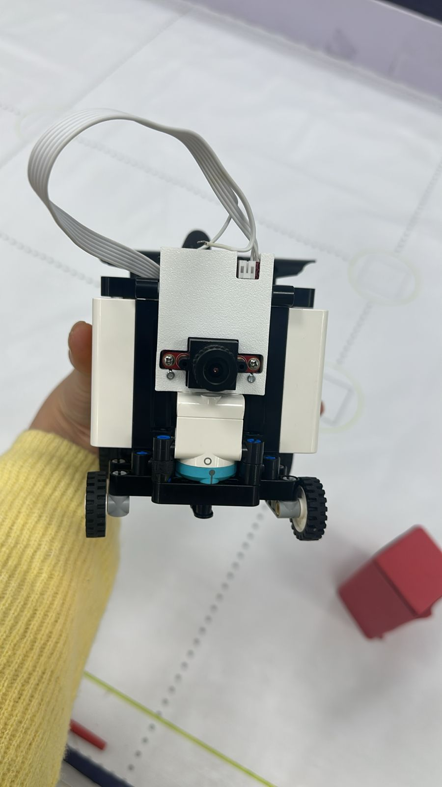
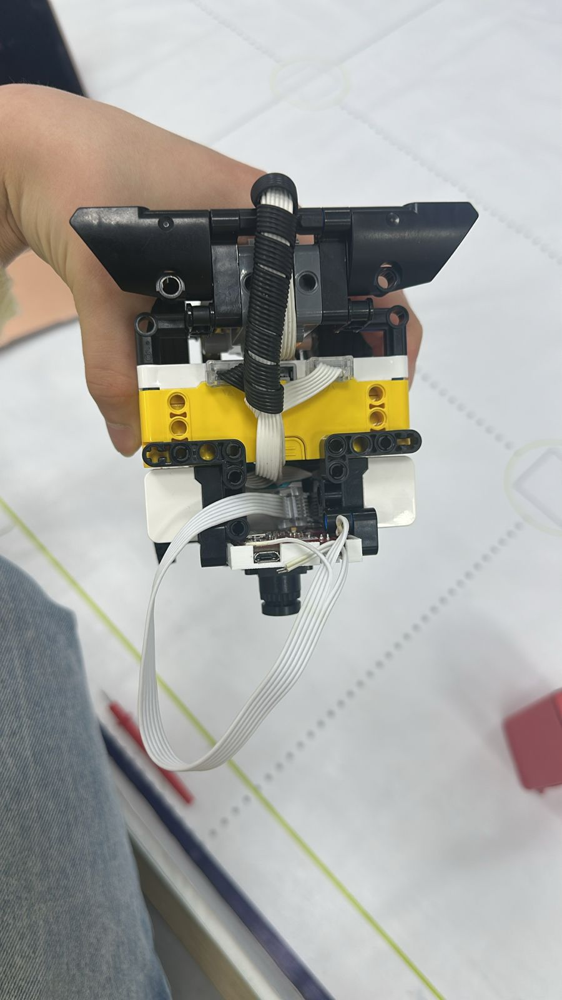
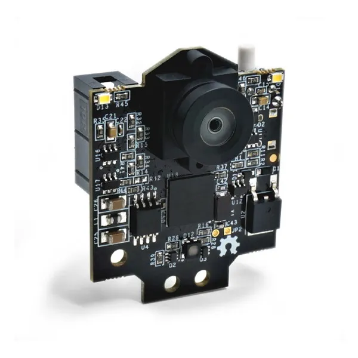

# WRO 2026 Future Engineers - Detailed Engineering Documentation
**Team:** XCLNC Lunar 
**Platform:** LEGO Spike Prime + Pixy2  
**Programming Language:** Python (Pybricks)

---

## The team
We are the XLNC Lunar team and we are competing in the 2026 WRO Future Engineers category.

## 1. Project Overview & The "Evolution" Strategy
Our goal for the 2026 season was to move away from "brute force" designs toward high-precision engineering. We focused on three pillars: **Stability, Compactness, and Data Reliability.**

### 1.1 Comparison with Previous Design
In our previous season, our robot was significantly larger and less efficient. 

* **Old Design:** Heavy chassis, high center of gravity, and complex but "sloppy" mechanical linkages. 
* **New Design (Current):** 50% smaller, with a concentrated center of mass over the front axle and a reinforced drivetrain.

---

## 2. Mobility Management: Mechanical Excellence

### 2.1 The Steering Debate: Parallel vs. Ackermann
During the prototyping phase, we conducted a study on steering geometries. While **Ackermann Steering** is ideal for real-world cars to reduce tire scrub, we intentionally chose **Parallel Steering** for this robot.

**Why Parallel Steering?**
1. **Precision in Micro-movements:** At the small scale of LEGO parts, the "play" (mechanical backlash) in Ackermann linkages often absorbs the steering input. Parallel steering provides a more direct and rigid connection to the motor.
2. **Maximum Turning Angle:** Our parallel mechanism allows for a 70-degree wheel rotation without the linkages locking up. This is crucial for the Parallel Parking maneuver where space is extremely limited.
3. **Friction Compensation:** Since we use thin front tires, the slight "sliding" effect of parallel steering actually helps the robot pivot faster in sharp corners without the bouncing effect often seen in complex LEGO linkages.

### 2.2 Rear Axle & Differential Logic
To ensure the robot doesn't skid during high-speed laps, we integrated a **LEGO Technic Differential**. 
* **The Problem:** A solid axle forces both wheels to rotate at the same speed, causing the inner wheel to lose traction in turns.
* **The Solution:** The differential allows the outer wheel to travel a longer path than the inner wheel. This results in smooth, predictable cornering and preserves the lifespan of our motors.

This is our differential before we changed the design and made the work more beautiful.
---

## 3. Sensor Fusion & Power Architecture

### 3.1 Pixy2 Vision Strategy
We use the **Pixy2.1 LEGO Edition** not just as a color sensor, but as a spatial coordinate generator.
* **Coordinate Mapping:** We map the X-center of detected signatures to a PID error value.
* **Frame Rate:** Running at 60 FPS allows the robot to react to an obstacle in less than 16ms, which is vital when moving at the robot's top speed of 1.2 m/s.
* 

### 3.2 Electronics & Power Stability
* **Hub Placement:** The Spike Prime Hub is mounted horizontally to keep the center of gravity low.
* **Power Management:** We use the 2100 mAh Li-ion battery. We found that the Pixy2 draws ~140mA; to prevent I2C brownouts, we ensure the battery never drops below 7.2V before a competitive run.

---

## 4. Software Engineering: The Python Advantage

We utilize **Pybricks (MicroPython)** instead of standard Word Blocks. This allows us to implement multi-threading for sensor reading and motor control.

### 4.1 Opening round:

Our team has decided to employ a simple strategy for completing the "open" round. The driving system itself uses a combination of the onboard gyroscope and ultrasonic sensor. The ultrasonic sensor measures the distance to the outer/inner wall and the robot attempts to maintain a certain distance (stored in a variable) from that wall. The gyroscope allows it to maintain a straight trajectory forward with minimum deviation. During the very first turn of the round, our robot scans the first line it passes over using a colour sensor and stores its value in a variable. This one-time operation tells our program if the robot is going clockwise or counter-clockwise (orange for clockwise and blue for counter-clockwise). This information then affects all the turns going forward, deciding whether the robot turns left or right by changing the desired turn angle to negative or vice-versa. Those turns are executed by changing the desired angle to 90 or -90 in our gyroscope function. The robot also uses a variable as a counter to check how many lines it has passed. Once that variable is equal to 12 (which means that all 3 laps are finished) the robot drives forward for a set period of time to land in its starting area and stops.

### 4.2 Obstacle round:

While there is no obstacle in the camera's field of view, our robot behaves similarly to the qualification run: maintaining a constant distance from the wall using an ultrasonic sensor and staying on track as well as making turns using a gyroscope. As soon as an obstacle enters the camera's field of view, the robot switches to detour mode. For detouring, we have created a predefined function in the form of kx+b with carefully calibrated coefficients. This line acts as the ideal path that the center of the detected obstacle needs to follow in the image frame. In short, we define where the obstacle should "appear" on the camera as the robot moves in a ideal situation. Using our "detour line" and the obstacle's XY position in the image frame, our robot can calculate the deviation of the obstacle from the ideal path and adjust its steering accordingly. This method provides our robot with consistency and ease of modification, due to the fact that every detour is mathematically identical and the coefficients of our ideal path can be changed with little effort to adapt to various situations.

### 4.3 Parking:

Once our robot has completed the required 3 laps, we start the parking algorithm. After the last turn, we slow down movement and drive until the ultrasonic sensor detects the "left" wall of the parking zone. During this drive, the same principle as in the qualification rounds applies, the robot attempts to stay within a certain distance from the outer wall).
As soon as the parking zone's wall is detected, the robot drives forward slightly before performing a predefined set of odometry maneuvers that land it safely inside the parking zone.
As you may have deduced, the above explanation only applies to counter-clockwise movement, as our primary ultrasonic sensor is located to the right of the robot and without it the detection of the parking zone is impossible. The solution to this, however, is simple. When driving clockwise, after finishing the final lap, the robot drives forward and performs a U-Turn, resulting in its position and direction being similar to its position during the beginning of our counter-clockwise parking algorithm (with negligible deviation). Once the U-Turn is performed, the robot applies that same counter-clockwise parking algorithm.

